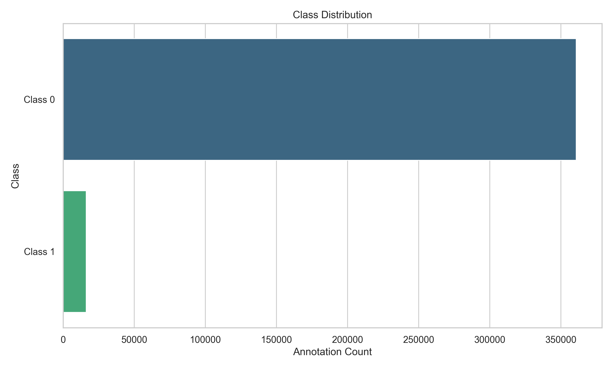
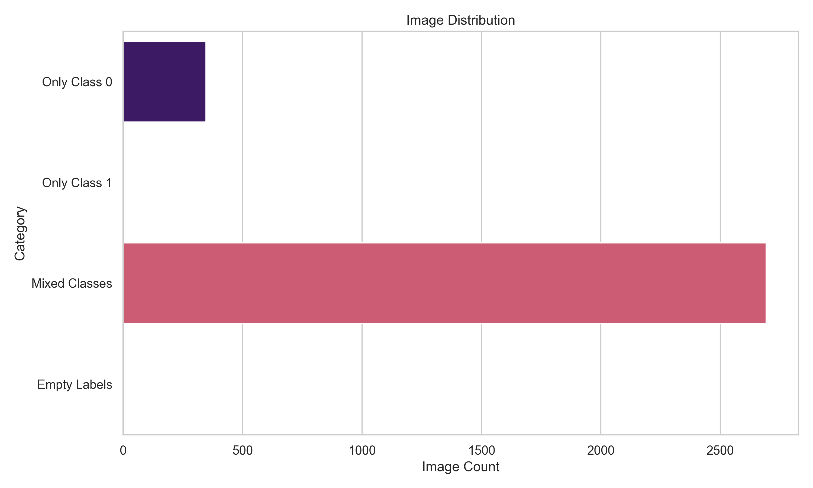
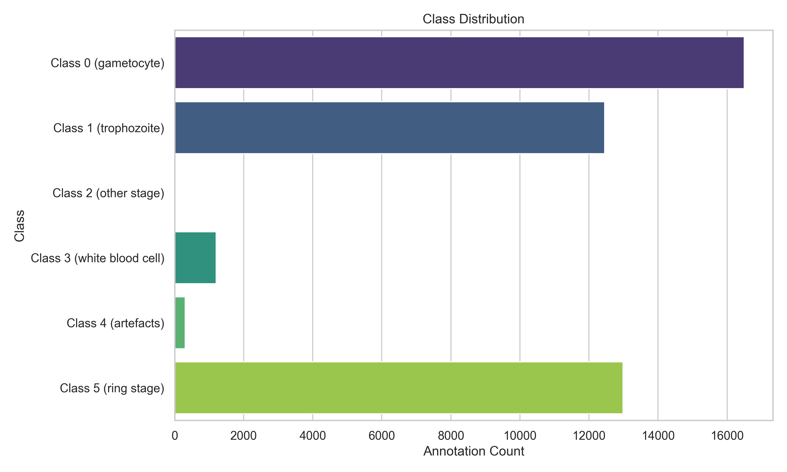
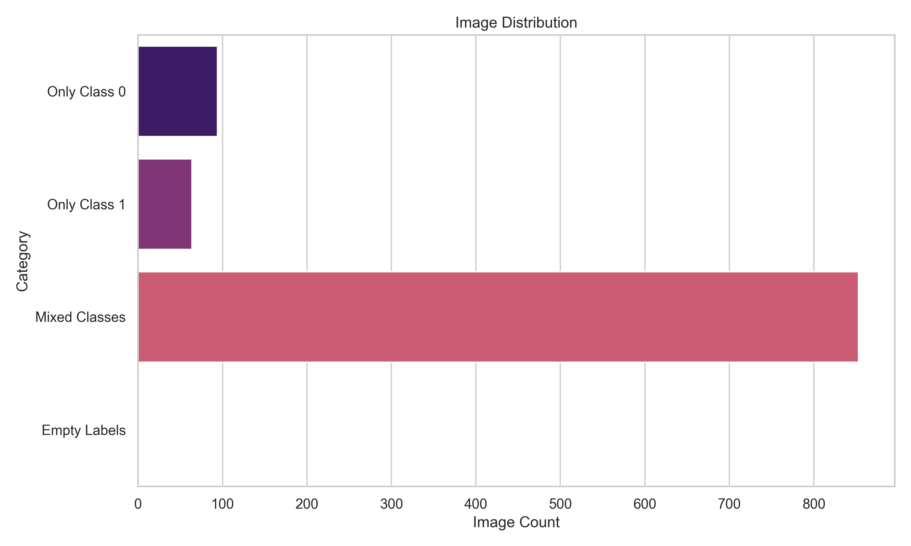

# Malaria Dataset Engine
A dataset-focused malaria AI engineering repository for microscopy blood smear dataset preparation, analysis, cleaning, and label verification.

This repository organizes and prepares malaria blood smear data, with an emphasis on dataset merging, class balance analysis, visualization, cleaning, and verification for future model development.

# Current Status
This repo captures the first phase of the project (malaria-ai-platform): building a malaria dataset engine.
Completed work includes:
- Merging and organizing multiple thin and thick smear datasets
- Performing dataset analysis and class imbalance analysis
- Visualizing dataset statistics and label distribution
- Cleaning and verifying dataset labels and YOLO annotations
- Organizing raw and cleaned dataset folders for downstream training
- Adding utility scripts for file handling, analysis, and verification

# Repository Scope
This repository is not yet a full modeling pipeline. It is focused on dataset engineering and preparation:
- Preparing raw smear images and labels for malaria detection and stage classification
- Standardizing dataset structure across sources
- Inspecting and validating YOLO label files
- Supporting dataset cleaning, verification, and reproducibility

# What has been done so far
- `step_001_dataset_merging.py`: merged datasets from multiple raw sources
- `step_002_dataset_analysis.py`: analyzed dataset composition and metadata
- `step_003_class_imbalance_analysis.py`: reviewed imbalance across classes
- `step_003_data_visualization.py`: generated visualizations for dataset insights
- `step_004_data_cleaning.py`: cleaned data and prepared the dataset for later modeling
- `utils/analysis_utils.py`, `utils/file_utils.py`, `utils/verification.py`: provided reusable dataset utility functions
- Organized `Malaria_00_AI/raw datasets/` and `Malaria_00_AI/Thick_CLEAN/`

# Dataset Types
This engine currently handles:
- Thin smear images for stage-level classification and morphology analysis
- Thick smear images for parasite detection and infection identification

# Future direction
A separate repository will be created for the next phase:
- `malaria-image-processing`

That future repository will focus on image preprocessing, augmentation, ROI extraction, and training models on the cleaned malaria datasets prepared here.

# Summary Results
The current dataset engine has produced a set of visualization outputs and summary statistics for both thick and thin smear data.

## Step-by-step results
- `step_001_dataset_merging.py`
  - Thick source dataset counts:
    - `Thick_P1`: 3,045 images, 3,045 label files
    - `Thick_P2`: 3,045 images, 3,045 label files
    - `Thick_P3`: 432 images, 3,045 label files
  - Merged dataset output:
    - 3,045 merged images and 3,045 merged label files
  - Clean dataset output:
    - 3,043 verified image-label pairs in `Thick_CLEAN`
    - perfect dataset matching: 0 images without labels and 0 labels without images

- `step_002_dataset_analysis.py`
  - Thick clean dataset:
    - 3,043 label files, 377,166 total annotations
    - class 0: 360,900 annotations
    - class 1: 16,266 annotations
    - image-level breakdown: 2,692 mixed-class images, 347 images with only class 0, 4 images with only class 1
  - Thin raw dataset:
    - 1,011 label files, 43,459 total annotations
    - class 0: 16,499 annotations
    - class 1: 12,458 annotations
    - class 2: 1 annotation
    - class 3: 1,205 annotations
    - class 4: 308 annotations
    - class 5: 12,988 annotations
    - image-level breakdown: 853 mixed-class images, 94 images with only class 0, 64 images with only class 1

- `step_003_class_imbalance_analysis.py`
  - Thick dataset imbalance:
    - ratio 22.19:1 (class 0 vs class 1)
    - recommendation: class weighting, augment minority class, consider Focal Loss, monitor minority recall
  - Thin dataset imbalance:
    - extreme class imbalance with class 2 only a single annotation
    - recommendation: flag rare classes, consider specialized sampling, and use strong class-balancing techniques

- `step_003_data_visualization.py`
  - Generated visualization outputs in `visualizations/` to document dataset composition and label distribution.
  - Visual assets created:
    - `visualizations/thick_class_distribution.png`
    - `visualizations/thick_image_distribution.png`
    - `visualizations/thin_class_distribution.png`
    - `visualizations/thin_image_distribution.png`

- `step_004_data_cleaning.py`
  - Cleaned the thick dataset and verified that the current `Thick_CLEAN` dataset contains only matched image-label pairs.
  - Removed empty label files from the clean dataset while preserving copies for review.

## Additional findings
- `issues_report/Empty labels` contains copies of the 2 removed empty label files: `429.txt`, `435.txt`
- The clean thick dataset is currently ready for the next preprocessing and model development stage.

## Visual summary
### Thick smear distributions

### Thin smear distributions

# Notes
- This repository is best described as a dataset engineering foundation for malaria AI research.
- Model training, advanced preprocessing, and production-ready pipelines are planned for the next repository phase.
